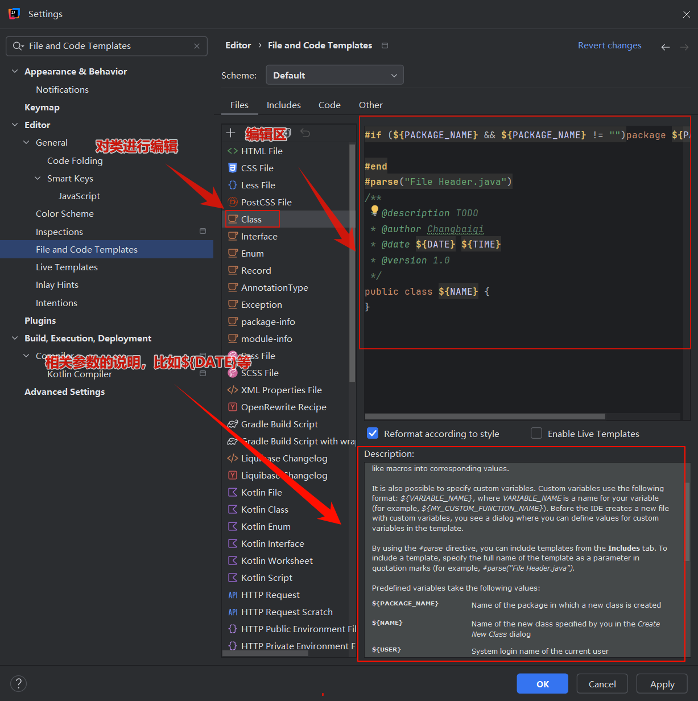
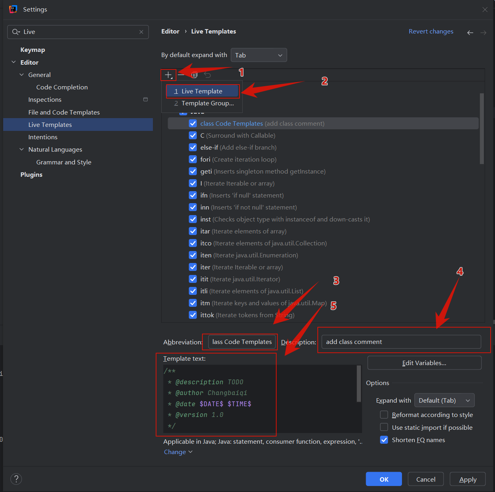

# IDEA注释模板设置

---

类注释模板：

```
/**
 * @description: TODO
 * @author Changbaiqi
 * @date 2023/6/16 23:24
 * @version 1.0
 */
```

## 一、创建类自动创建注释

1、首先进入IDEA设置里面：

File-->setttings-->Editor-->File and Code Templates-->Files

然后选择Class文件（当然你要设置接口的也可以选择Interface文件）

* ${NAME}：设置类名
* TODO：代办事项的标记，一般生成类或者方法都需要添加描述
* \$\{USER\}、\$\{DATE\}、\$\{TIME\}：撤职创建类的用户、创建的日期和时间，这些是IDEA内置的方法，还有一些其他的方法可以通过查阅获取。
* 版本号设置：设置版本号，一般新建的类都是1.0版本，这里写死就可以了。



## 二、自定义快捷键类注释模板

1、进入对应快捷键设置：

File-->setttings-->Editor-->Live Templates

然后添加快捷键模板，其中：

3：为快捷键的名称，注意，这个名称就是你以后所需要提示的快捷键的关键字。

4：快捷键的描述说明

5：具体的快捷键模板生成内容

